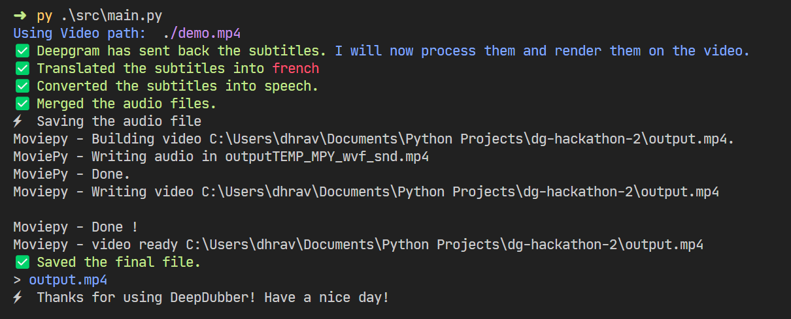

## DeepDubber

Dubs the video in another language, Powered by Deepgram API and Google Translate.
> This was made as a submission for the [DeepGram x Dev](https://dev.to/devteam/join-us-for-a-new-kind-of-hackathon-on-dev-brought-to-you-by-deepgram-2bjd) Hackathon

***
<br><br>


Check out the [Assets folder](./assets/) for Demo videos. 

# 👀 Why DeepDubber?

<font align="left" size="3">
  <ul>
    <li>Sometimes, we need to quickly dub a video in another language.</li>
    <li>DeepDubber automatically generates subtitles, translates it to another language and then adds it to the video.</li>
  </ul>
</font>

<br>


# Usage
Using is very easy, just follow the steps below:

Clone the repository:

```bash
git clone https://github.com/dhravya/deepdubber.git
```

Install the dependencies:

```bash
pip install -r requirements.txt
```

Run src/main.py (Make sure to change the path to your video, and feel free to configure as you want.):

```bash
python ./src/main.py
```

I've only tested this on Windows, but it should work on linux and MacOS too.

And now, sit back and enjoy the magic! ✨ 



## Made possible by:
- [Dev.to](https://dev.to)
- [Deepgram](https://deepgram.com)
- [Google Translate](https://translate.google.com/)
- [MoviePy](https://pypi.org/project/moviepy)


## License 
This project is under the [MIT License](LICENSE)

## Support
- Follow me on Github: [@dhravya](https://github.com/dhravya)
- Follow me on Twitter: [@dhravyashah](https://twitter.com/dhravyashah)

[](https://ko-fi.com/R6R782RBF)